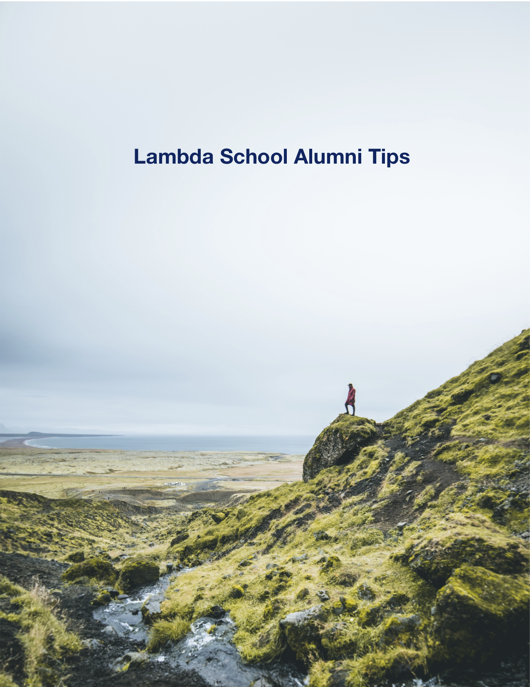

# Lambda School Alumni Tips

Compiled and edited by Nathan Thomas. Please see [Author](#author) section for more details.

## Introduction

While sending out LinkedIn invites, I decided to start asking alumni (and, admittedly, people in older cohorts that are closer to graduating) what tips they had for a new student. What I found was an amazingly gifted group of individuals that opened their minds up to help me learn from their successes and mistakes. I think these actions speaks to the strength of Lambda School as well as the quality of the individuals that graduate from it.

It is because of this that I decided to compile everything into a single place and pass it on to my classmates so that you can benefit from it as well. Every single person quoted in this document has given me their express permission for me to do so. Every single one of them remembers what it was like to be in your shoes, and they want to give back to the community that they’ve come from. I hope that their advice helps you in your journey and enables you to reach the goals you made when you entered Lambda.

(NOTE: Please see the [Contributing](#contributing) section if you would like to add your own knowledge to this document.)

## Alumni (and Older Cohort) Contributors

Christopher Atoki [LinkedIn](https://www.linkedin.com/in/christopher-atoki/) 
Rachel DiCesare [LinkedIn](https://www.linkedin.com/in/rachel-dicesare-a86889ba/) 
Austin Howes [LinkedIn](https://www.linkedin.com/in/austinhowes/) 
Bernard Johnson [LinkedIn](https://www.linkedin.com/in/bernard-johnson-b59b86168/) 
Kyle Kauzlarich [LinkedIn](https://www.linkedin.com/in/kyle-kauzlarich-781b86140/) 
Henry Kim [LinkedIn](https://www.linkedin.com/in/henrykim212/) 
Jason Nuhn [LinkedIn](https://www.linkedin.com/in/jasonnuhn/) 
William Pelton [LinkedIn](https://www.linkedin.com/in/william-pelton/) 
Grant Reighard [LinkedIn](https://www.linkedin.com/in/grantreighard/) 

## Table of Contents

1. [Blogging](#blogging)
2. [Job Search](#job-search)
3. [Personal Website or Portfolio](#personal-website-or-portfolio)
4. [Presentations](#presentations)
5. [Self Care](#self-care)
6. [Studying](#studying)

### Blogging

- “It would be great if you could blog every week about your experiences at Lambda. I just read a PM’s blog, and I wish I had done that.” - Grant Reighard

- “Medium is the go-to blogging service for tech stuff in my opinion. There’s also creating a WordPress blog on your own domain if you buy that (plus hosting).” - Grant Reighard

### Job Search

- “Always network. People always want to hire from within. Anyone can learn to code, so if they like you as a culture fit and are confident and passionate about being there, then you're 90% of the way to the finish line. “ - Austin Howes

- “Lambda will have your back every step of the way. Try to stand out as someone who will evangelize for the school and look out for other students and they're going to want to make sure their name is stamped to you in a good job somewhere. Basically, they take care of their own, so try and make sure you brand yourself as a team player, if that makes sense.” - Austin Howes

### Personal Website or Portfolio

- “Start your portfolio page from something like the second week after you learn HTML and CSS and then continue to update and add new features as you learn new things.” - Christopher Atoki

- “Pick either .com or .io [for your domain name]. I probably wouldn’t use .net. I would even use .code before .net.” - Christopher Atoki

- “Buy a good domain name and host it if you can afford it. I got grantreighard.com.” - Grant Reighard

- “Always go for the .com [domain name] for the most authority. You could alternately buy several and redirect one to the other.” - Grant Reighard

### Presentations

- “Do at least one brown bag presentation [while in Lambda School].” - William Pelton

### Self Care

- "Be sure to take many breaks, eat healthy meals, and get yourself out of the house as much as possible. Don’t stay up so late coding, and always get a good nights rest." - Rachel DiCesare

- “Take more breaks. Use a pomodoro app. Sleep as much as you need. Go exercise. Eat right. Shower.” - William Pelton

### Studying

- “Definitely take notes. Remember that there is almost never one way of doing things. So a good task is when you learn how to do something always try to other ways to do it. And another thing is start your portfolio page from something like the second week after you learn HTML and CSS and then continue to update and add new features as you learn new things.” - Christopher Atoki

- “Practice, practice. Each and every day, keep coding even if you have the day off for at least an hour. You don’t want to get rusty, but do NOT burn yourself out. It is so important to take breaks.” - Rachel DiCesare

- “Make sure you do pair programming because it could do you wonders, especially when you enter the CS portion [of the program]. The PMs try to get people in their groups paired up together, but most of the time people have to seek that out on their own.” - Rachel DiCesare

- “I'd really recommend making sure you choose a favorite stack and really take ownership over it. So if you start finding you really like React with Python/Django, then start building full stack functioning apps over and over again. Learn how to build a full backend and frontend and choose one way to do it and learn it to the point of full ownership over that stack. Go is great for backend! Vue is great for front! None of that really matters tho.. What you'll get from this advice is such a great birds eye view of how it has to work regardless of language, and get used to making API calls to a DB, you'll find yourself very well equipped to switch to any other tech stack you're asked to.” - Austin Howes

- “Pay attention to data structures. It’s always surprising when and how those come up, and you’ll be grateful to know them! - Austin Howes

- “If you're comfortable with HTML and CSS, try and get as solid of a foundation as you can get in Javascript. Some of the more advanced JS topics gave a good number of students from my cohort a tough time. Plus, React is built on those topics so getting a solid JS understanding can pave the way through the front end section. Personally, I went through all but the last few algorithm sections for JS on FreeCodeCamp. Then there is a YouTube channel called Traversy Media, and he has a tutorial working with the DOM. That tutorial got me really prepared for the DOM sections at Lambda.” - Bernard Johnson

- “Just utilize all of the resources and spend the extra time doing code challenges outside of the daily one.” - Kyle Kauzlarich

- “At any level of coding, there are no dumb questions no matter how dumb the question might actually seem. If you don't know the answer and you've searched for the answer yourself, then please ask those who are more experienced. Ask your fellow buddies or PMs to fill in the blanks asap. It's better to leave no stones unturned rather than finding out later in your study that you should've figured it out beforehand.” - Henry Kim

* “Coding 9-5 daily is grueling. Some people really enjoy it. But for myself personally, I was starting to burn out about 4 months in. The more I learned, the more I realized I'm not great at coding, and my self-confidence tanked quite a bit in the process. If you do find yourself in the same situation, don't worry. Coding has a such demanding learning curve (more so when you get into more complex stuff later on), so don't lose heart. A lot of people (if not most) went through similar experiences in my cohort.” - Henry Kim

* “Keep the fire alive no matter how weakly or strongly it burns.” - Henry Kim

* “Do a lot of practice, and perhaps find a few people to work on pair programming with. I got a crew of 5 that I kept in touch with afterwards. Nothing like it.” - Jason Nuhn

* “This is the most a human being can learn in a six month period. It will feel like failing if you're doing it right. Labs may be the first time you will feel genuinely competent at this.” - William Pelton

* “Reaching out to TAs and instructors is how you get the full benefit of your education. You will be paying these people 17% of your gross income for two years, so don't be shy.” - William Pelton

* “Do literally everything the instructors and staff tell you, from the algorithm exercises to the resume formatting.” - William Pelton

* “People learning right next to you are a great resource, but also just as likely not to know the answer as you. The docs are a fast, reliable way to get the right answer.” - William Pelton

* “Be prepared for the next day by watching the precourse videos the night before (I believe this is the new standard they're going for anyway). Work on personal projects on the side and over weekends. Refine projects you work on during class so you can show them off to future employers.” - Grant Reighard

## Contributing

If you are an alumni or a member of an older cohort that would like to pass on tips for success to new classes and cohorts at Lambda, please either contact me on Slack or submit a pull request to update this repository. This document is meant to grow with time.

## Author

- **Nathan Thomas** - [LinkedIn](https://www.linkedin.com/in/nathan-thomas-644b3339/), [GitHub](https://github.com/nwthomas), Slack username _nwthomas_

## License

This project is licensed under the MIT License - see the [LICENSE](LICENSE) file for details

## Acknowledgments

- Thanks to whomever started the LinkedIn spreadsheet inside of Lambda School. It is a great networking tool.
- Thanks to Austin Allred and the entire staff at Lambda School for the work that you do in training the bright minds of tomorrow. We appreciate you and your vision.
- Cover page photography by [Alexander Milo](https://unsplash.com/photos/5g5MLKq-QxM) on Unsplash.com
